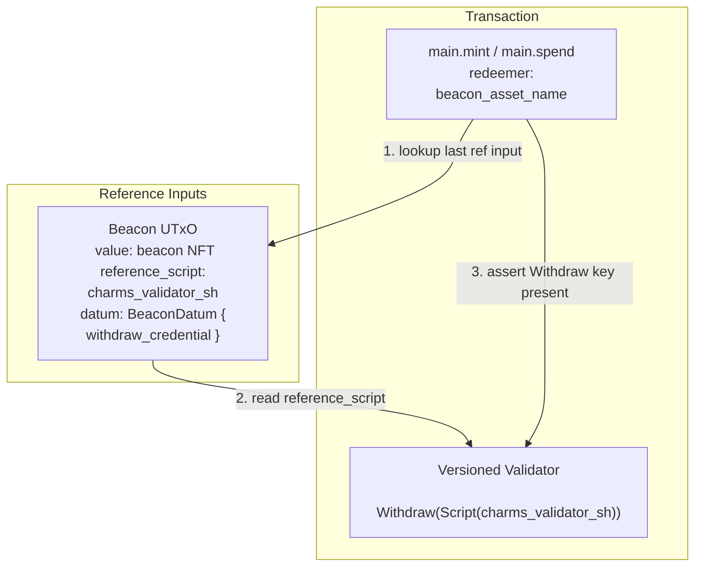

# Main

A routing script that delegates validation to the appropriate versioned validator based on the beacon token present in the transaction.

# Table of Contents

- [Overview](#overview)
- [Parameters](#parameters)
- [Types](#types)
  - [BeaconParts](#beaconparts)
  - [BeaconDatum](#beacondatum)
- [Core Logic](#core-logic)
  - [Beacon Lookup](#beacon-lookup)
  - [Delegation via Withdraw-0](#delegation-via-withdraw-0)
- [Script Purposes](#script-purposes)
- [Transaction Flow](#transaction-flow)
- [Examples](#examples)

# Overview

The Main validator is a thin routing script. It contains no application-level validation logic itself. Instead, it:

1. Accepts a redeemer specifying which versioned validator to delegate to (as a beacon NFT asset name)
2. Locates the corresponding beacon UTxO in the transaction's reference inputs
3. Reads the versioned validator's script hash from the beacon UTxO's `reference_script` field
4. Verifies that the versioned validator is invoked as a staking withdrawal in the same transaction

This pattern (known as *withdraw-0 staking validation*) keeps the main script extremely small, while all substantive validation is offloaded to the versioned validator. Multiple versions can coexist on-chain simultaneously, each identified by a distinct beacon NFT asset name.

# Parameters

The `main` validator is parameterized at compile time:

| Parameter | Type | Description |
| --- | --- | --- |
| `version_nft_policy_id` | `ScriptHash` | The minting policy ID of the beacon NFT, identifying the version registry |
| `_app_vk` | `ByteArray` | Reserved for future use (application verification key) |

# Types

## BeaconParts

Defined in `lib/charms-cardano/beacon.ak`. Used off-chain and in tests to construct beacon NFT asset names from a shared prefix, a version identifier, and a suffix.

```aiken
pub type BeaconParts {
  policy_id: ScriptHash,
  name_prefix: ByteArray,
  name_suffix: ByteArray,
}
```

A beacon asset name is constructed by concatenation:

```math
\text{asset\_name} = \text{name\_prefix} \mathbin{||} \text{version} \mathbin{||} \text{name\_suffix}
```

```aiken
pub fn beacon_asset_name(beacon: BeaconParts, version: ByteArray) -> ByteArray {
  beacon.name_prefix
    |> bytearray.concat(version)
    |> bytearray.concat(beacon.name_suffix)
}
```

## BeaconDatum

Each beacon UTxO carries an inline datum of this type:

```aiken
pub type BeaconDatum {
  withdraw_credential: ScriptHash,
}
```

The `withdraw_credential` field identifies the versioned validator (e.g. Scrolls or Groth16) that governs transactions using this beacon. This datum is primarily useful for off-chain discovery and indexing. The on-chain `main` logic reads the versioned validator script hash directly from the UTxO's `reference_script` field instead.

# Core Logic

The internal `main_impl` function contains all validation logic and is shared between the `mint` and `spend` handlers:

```aiken
fn main_impl(
  version_nft_policy_id: ScriptHash,
  version_nft_name: ByteArray,
  self: Transaction,
) -> Bool {
  expect Some(ref_input) = list.last(self.reference_inputs)
  expect
    has_nft(ref_input.output.value, version_nft_policy_id, version_nft_name)

  expect Some(charms_validator) = ref_input.output.reference_script

  self.redeemers |> pairs.has_key(Withdraw(Script(charms_validator)))
}
```

## Beacon Lookup

The last reference input in the transaction is expected to be the beacon UTxO. The contract asserts:

1. A reference input exists at that position
2. Its `value` contains the beacon NFT, identified by `version_nft_policy_id` and the redeemer as the asset name
3. Its output has a non-empty `reference_script` field containing the versioned validator's script hash

## Delegation via Withdraw-0

Once the versioned validator's script hash (`charms_validator`) is resolved from the beacon, the contract asserts:

```math
\exists\; r \in \text{tx.redeemers} \;.\; r.\text{key} = \text{Withdraw}(\text{Script}(\textit{charms\_validator}))
```

This means the versioned validator **must be invoked as a staking withdrawal** in the same transaction. Any substantive validation rules — signature checks, zk-SNARK verification, etc. — are enforced entirely by that validator.

If the required withdrawal is absent, or references a different script hash than the one stored in the beacon, the transaction fails.

# Script Purposes

The `main` validator handles two script purposes, both delegating to `main_impl`:

| Purpose | Redeemer | Unused Params |
| --- | --- | --- |
| `mint` | `ByteArray` (beacon asset name) | `_policy_id: PolicyId` |
| `spend` | `ByteArray` (beacon asset name) | `_datum_opt: Option<Data>`, `_utxo: OutputReference` |

Any other script purpose is an explicit failure:

```aiken
else(_ctx: ScriptContext) {
  fail @"invalid script purpose"
}
```

# Transaction Flow



The redeemer passed to `main.mint` or `main.spend` is the beacon NFT asset name. This acts as a selector: different versions of the Charms protocol each have their own beacon NFT, and by providing the corresponding asset name the user directs `main` to the correct versioned validator.

# Examples

## Scrolls (V1) Transaction

A transaction delegating to the Scrolls validator using the withdraw-0 pattern:

```aiken
let scrolls_sh = #"51d44678ebc1fe5a5dd58cafb3bcd31f0f5be1fc1de97e97deb1380c"

// Beacon UTxO placed in reference inputs
let beacon_output =
  Output {
    address: from_script(some_script_sh),
    value: from_asset(
      test_beacon_parts.policy_id,
      beacon_asset_name(test_beacon_parts, test_charms_version),
      1,
    ),
    datum: InlineDatum(BeaconDatum { withdraw_credential: scrolls_sh }),
    reference_script: Some(scrolls_sh),
  }

let ref_input =
  Input {
    output_reference: OutputReference { output_index: 1, transaction_id: #"" },
    output: beacon_output,
  }

// Scrolls withdrawal redeemer (ICP verifier's signature)
let redeemers: Pairs<ScriptPurpose, Redeemer> =
  [Pair(Withdraw(Script(scrolls_sh)), verifier_signature)]

let tx =
  Transaction {
    ..placeholder,
    redeemers,
    reference_inputs: [ref_input],
  }

// Main resolves the beacon, finds scrolls_sh, and asserts Withdraw is present.
// The Scrolls validator then checks the ICP verifier's signature.
main_impl(test_beacon_parts.policy_id, beacon_asset_name(test_beacon_parts, test_charms_version), tx)
```