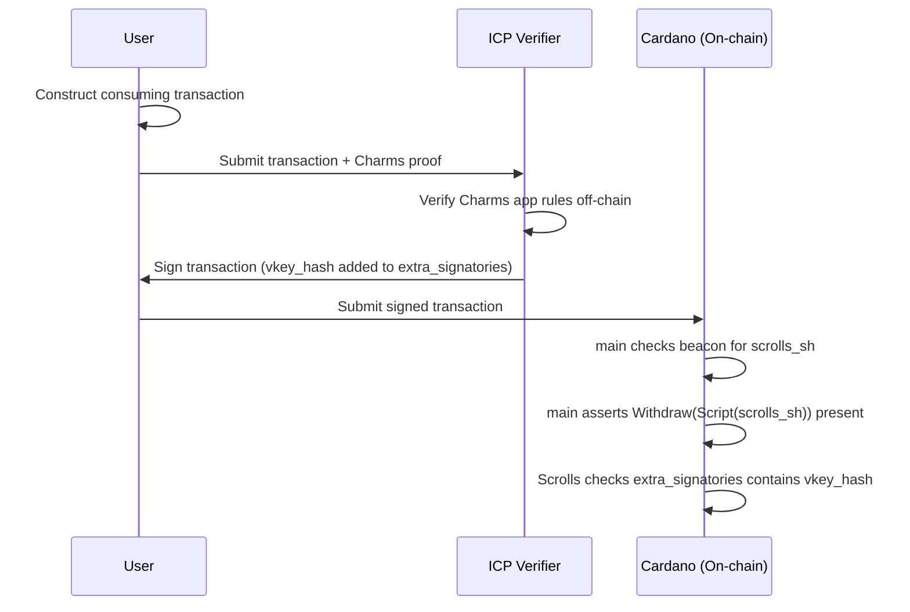

# V1 Scrolls Validator

A staking withdrawal validator that authorises Charms transactions using a trusted ICP (Internet Computer Protocol) verifier's signature.

# Table of Contents

- [Overview](#overview)
- [V1 Flow](#v1-flow)
- [Parameters](#parameters)
- [Script Purposes](#script-purposes)
  - [Withdraw](#withdraw)
  - [Publish](#publish)
- [Security Considerations](#security-considerations)
- [Examples](#examples)

# Overview

The Scrolls validator is the versioned validator for **V1 Charms**. It implements a trust-based authorisation model: rather than verifying a zk-SNARK proof on-chain, it relies on a trusted ICP verifier to approve transactions off-chain, with that approval expressed as a required signatory on the Cardano transaction.

A transaction is considered valid under V1 if and only if the ICP verifier's key hash is present in the transaction's `extra_signatories`:

$$\text{valid} \iff \textit{vkey\_hash} \in \text{tx.extra\_signatories}$$

The Scrolls validator is never invoked directly as a spending or minting script. It is registered on-chain as a staking credential and invoked via the *withdraw-0 staking validation* pattern — `main` resolves it from the beacon UTxO and requires it to be present as a withdrawal in the same transaction.

# V1 Flow



The ICP verifier acts as a trusted third party. If the submitted Charms proof satisfies the app rules, the verifier signs the transaction. The on-chain Scrolls validator confirms that this signature is present before the transaction is accepted.

# Parameters

The `scrolls` validator is parameterized at compile time:

| Parameter | Type | Description |
| --- | --- | --- |
| `vkey_hash` | `VerificationKeyHash` | The public key hash of the trusted ICP verifier |

This parameter is baked into the script at deployment. A different `vkey_hash` produces a different script hash, and therefore a different beacon UTxO. This means each deployment of the Scrolls validator is bound to exactly one verifier key.

# Script Purposes

## Withdraw

```aiken
withdraw(_redeemer: Data, _account: Credential, self: Transaction) {
  self.extra_signatories |> list.has(vkey_hash)
}
```

The withdraw handler performs a single check: the `extra_signatories` of the transaction must include the trusted verifier's key hash. The redeemer and account credential arguments are not used — authorisation is determined entirely by the presence of the signature.

If `vkey_hash` is not found in `extra_signatories`, the handler fails and the transaction is rejected.

## Publish

```aiken
publish(_redeemer: ByteArray, certificate: Certificate, _self: Transaction) {
  when certificate is {
    RegisterCredential { .. } -> True
    _ -> False
  }
}
```

The publish handler only permits the `RegisterCredential` certificate. This allows the Scrolls staking script to be registered on-chain — a prerequisite for the withdraw-0 pattern, since a staking withdrawal can only be submitted for a registered credential — while blocking all other certificate operations such as deregistration or delegation.

| Certificate | Permitted |
| --- | --- |
| `RegisterCredential` | ✓ |
| `UnregisterCredential` | ✗ |
| `DelegateCredential` | ✗ |
| Any other | ✗ |

# Security Considerations

### Trust Assumption

The Scrolls validator inherits the trust model of the ICP verifier. If the verifier is compromised or misbehaves, it could sign invalid transactions. This is an explicit design choice in V1 in exchange for simpler on-chain logic.

V2 removes this trust assumption entirely by replacing ICP signatures with trustless zk-SNARK proofs verified on-chain.

### Signature Uniqueness

The `vkey_hash` parameter is fixed at deployment time and baked into the script. Only the designated verifier can authorise V1 Charms transactions — there is no mechanism to add or substitute signers without deploying a new script.

### Replay Protection

Replay protection is handled by the Cardano ledger: each UTxO input can only be consumed once. A transaction signed by the verifier cannot be resubmitted after its inputs have been spent.

### Deregistration
The `publish` handler permits only `RegisterCredential`, so the Scrolls staking credential cannot be deregistered on-chain through the validator itself.

# Examples

## Valid Authorisation

```aiken
let vkey_hash = #"b3346443e14de85048f2210d0d39cd38a7ddcd6839ee1630307e6af6"
let credential = Script(vkey_hash)

// Transaction signed by the ICP verifier
let transaction =
  Transaction { ..placeholder, extra_signatories: [vkey_hash] }

// Passes: vkey_hash is present in extra_signatories
scrolls.withdraw(vkey_hash, Void, credential, transaction)
```

## Missing Signature

```aiken
let vkey_hash = #"b3346443e14de85048f2210d0d39cd38a7ddcd6839ee1630307e6af6"
let other_vkey_hash = #"a1234567e14de85048f2210d0d39cd38a7ddcd6839ee1630307e6af6"
let credential = Script(vkey_hash)

// Transaction signed by the wrong key
let transaction =
  Transaction { ..placeholder, extra_signatories: [other_vkey_hash] }

// Fails: vkey_hash not present in extra_signatories
scrolls.withdraw(vkey_hash, Void, credential, transaction)
```

## Credential Registration

```aiken
let certificate =
  RegisterCredential {
    credential: Script(vkey_hash),
    deposit: NoDatum,
  }

// Passes: RegisterCredential is the only permitted certificate type
scrolls.publish(vkey_hash, #"", certificate, placeholder)
```
