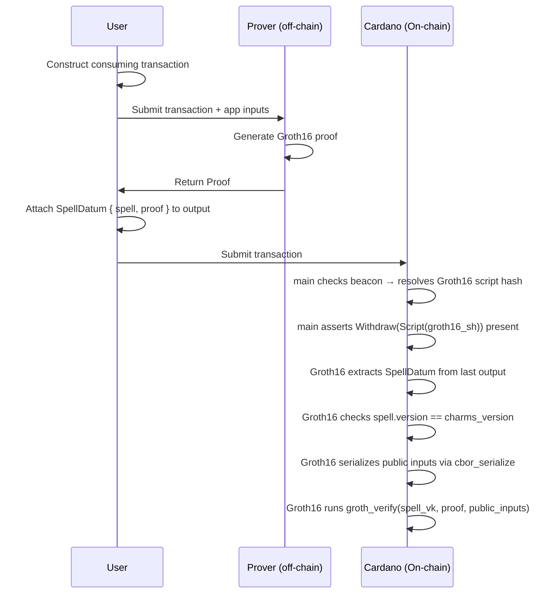

# V2 Groth16 Validator

A staking withdrawal validator that authorises Charms transactions by verifying a Groth16 zk-SNARK proof on-chain.

# Table of Contents

- [Overview](#overview)
- [V2 Flow](#v2-flow)
- [Parameters](#parameters)
- [Types](#types)
  - [SpellDatum](#spelldatum)
  - [NormalizedSpell](#normalizedspell)
  - [App](#app)
  - [SnarkVerificationKey](#snarkverificationkey)
  - [Proof](#proof)
- [Core Logic](#core-logic)
  - [Spell Extraction](#spell-extraction)
  - [Version Check](#version-check)
  - [Public Input Serialization](#public-input-serialization)
  - [Groth16 Verification](#groth16-verification)
- [Script Purposes](#script-purposes)
  - [Withdraw](#withdraw)
- [Security Considerations](#security-considerations)
- [Examples](#examples)

# Overview

The Groth16 validator is the versioned validator for **V2 Charms**. It implements a trustless authorisation model using the [Groth16](https://eprint.iacr.org/2016/260) zk-SNARK proving system, verified directly on Cardano using BLS12-381 pairings available as native Plutus builtins.

Rather than relying on a trusted off-chain party (as in V1 Scrolls), any party can produce a valid proof and submit a transaction — no privileged signer is required. The on-chain verifier checks that the submitted proof is valid for the public inputs derived from the transaction's spell datum, under the verification key baked into the script at deployment.

A transaction is valid under V2 if and only if:

```math
\text{groth\_verify}(\textit{spell\_vk},\ \textit{proof},\ \text{cbor\_serialize}(\textit{spell\_vk},\ \textit{spell})) = \top
```

The validator is registered as a staking credential and invoked via the *withdraw-0 staking validation* pattern — `main` resolves it from the beacon UTxO and requires it to be present as a withdrawal in the same transaction.

# V2 Flow



No trusted party is involved. The prover can be the user themselves or any service — the on-chain verifier is the sole source of truth.

# Parameters

The `staking_groth16` validator is parameterized at compile time:

| Parameter | Type | Description |
| --- | --- | --- |
| `spell_vk` | `SnarkVerificationKey` | The Groth16 verification key for the Charms app circuit |
| `charms_version` | `Int` | The expected Charms protocol version encoded in the spell datum |

Both parameters are fixed at deployment. A different `spell_vk` or `charms_version` produces a different script hash and therefore a different beacon UTxO.

# Types

## SpellDatum

The datum attached to the spell output (last output of the transaction):

```aiken
pub type SpellDatum {
  spell: NormalizedSpell,
  proof: Proof,
}
```

This output carries both the public statement (`spell`) and the proof of its validity (`proof`). The validator extracts both from the datum and uses them together for verification.

## NormalizedSpell

Represents the normalized form of a Charms transaction, serving as the public statement of the zk-SNARK:

```aiken
pub type NormalizedSpell {
  version: Int,
  tx: Data,
  app_public_inputs: Pairs<App, Data>,
  mock: Bool,
}
```

| Field | Description |
| --- | --- |
| `version` | Charms protocol version; must match `charms_version` parameter |
| `tx` | The transaction data included in the proof statement |
| `app_public_inputs` | Per-app public inputs, keyed by `App` |
| `mock` | Flag indicating whether this is a mock/test proof |

## App

Identifies a specific app within the Charms protocol:

```aiken
pub type App {
  tag: String,
  identity: ByteArray,
  vk: SnarkVerificationKey,
}
```

Each `App` carries its own verification key, allowing the proof to cover multiple apps in a single transaction.

## SnarkVerificationKey

The Groth16 verification key, operating over the BLS12-381 elliptic curve:

```aiken
pub type SnarkVerificationKey {
  nPublic: Int,       // number of public inputs
  vkAlpha: ByteArray, // G1Element
  vkBeta: ByteArray,  // G2Element
  vkGamma: ByteArray, // G2Element
  vkDelta: ByteArray, // G2Element
  vkAlphaBeta: List<ByteArray>, // List<G2Element>
  vkIC: List<ByteArray>,        // List<G1Element>
}
```

## Proof

The Groth16 proof, consisting of three elliptic curve points:

```aiken
pub type Proof {
  piA: ByteArray, // G1Element
  piB: ByteArray, // G2Element
  piC: ByteArray, // G1Element
}
```

# Core Logic

The `withdraw` handler executes four steps in sequence:

```aiken
withdraw(_redeemer: ByteArray, _account: Credential, self: Transaction) {
  expect Some(spell_output) = list.last(self.outputs)
  expect SpellDatum { spell, proof } = extract_spell(spell_output.datum)
  expect charms_version == spell.version
  let app_public_inputs = cbor_serialize(spell_vk, spell)
  groth_verify(spell_vk, proof, app_public_inputs)
}
```

## Spell Extraction

The last output of the transaction is expected to carry the `SpellDatum`. The `extract_spell` function requires an inline datum — `NoDatum` and `DatumHash` both cause an immediate failure:

```aiken
pub fn extract_spell(datum: Datum) -> Data {
  when datum is {
    NoDatum -> fail
    DatumHash(_h) -> fail
    InlineDatum(d) -> d
  }
}
```

The datum is then pattern-matched to `SpellDatum { spell, proof }`. If the datum cannot be decoded into this type, the transaction fails.

## Version Check

The `version` field of the extracted spell is compared against the `charms_version` parameter baked into the script:

```aiken
expect charms_version == spell.version
```

This ensures that the proof was generated for the correct version of the Charms protocol and prevents version mismatch attacks where a proof for an older or newer circuit is submitted.

## Public Input Serialization

The public inputs to the zk-SNARK circuit are derived by CBOR-serializing the `(spell_vk, spell)` pair into a flat list of bytes:

```aiken
pub fn cbor_serialize(
  spell_vk: SnarkVerificationKey,
  spell: NormalizedSpell,
) -> List<Int> {
  bytearray_to_list(serialise_data((spell_vk, spell)))
}
```

This means the circuit's public statement is the full tuple of the verification key and the normalized spell. Both the prover and the on-chain verifier must agree on this serialization.

## Groth16 Verification

The final step calls `groth_verify` from the `ak-381` library, which implements the Groth16 verification equation using BLS12-381 pairings:

```aiken
groth_verify(spell_vk, proof, app_public_inputs)
```

Internally, this computes:

```math
e(\pi_A, \pi_B) \stackrel{?}{=} e(\alpha, \beta) \cdot e\!\left(\sum_{i=0}^{l} x_i \cdot \text{IC}_i,\ \gamma\right) \cdot e(\pi_C, \delta)
```

where $x_i$ are the serialized public inputs and $\text{IC}_i$ are the input commitments from the verification key. All pairing operations use the BLS12-381 curve and are computed via native Plutus builtins.

If the equation does not hold — i.e. the proof is invalid for the given public inputs and verification key — `groth_verify` returns `False` and the transaction fails.

# Script Purposes

## Withdraw

The `withdraw` handler is the only active script purpose. The redeemer and account credential are unused — all validation is driven by the transaction's outputs and the script parameters.

```aiken
withdraw(_redeemer: ByteArray, _account: Credential, self: Transaction) { .. }
```

Any other script purpose is an explicit failure:

```aiken
else(_ctx: ScriptContext) {
  fail @"invalid redeemer in staking_groth16"
}
```

# Security Considerations

### Trustlessness

Unlike V1 Scrolls, V2 requires no trusted third party. The validity of the transaction is guaranteed entirely by the cryptographic soundness of the Groth16 proving system and the BLS12-381 implementation in Plutus.

### Verification Key Binding
The `spell_vk` is baked into the script at deployment. This means the on-chain verifier is permanently bound to a specific circuit. Upgrading the circuit requires deploying a new script with a new verification key and updating the beacon UTxO.

### Version Binding

The `charms_version` parameter ensures that proofs generated for a different protocol version cannot be submitted to this validator. This prevents cross-version replay where an older valid proof is reused under a newer deployment.

### Datum Position

The validator always reads the **last** output of the transaction as the spell output. Off-chain tooling must place the `SpellDatum` at this position. An incorrectly positioned datum will cause the `expect` to fail, rejecting the transaction.

### Public Input Integrity
The public inputs are derived deterministically from `(spell_vk, spell)` via CBOR serialization. Since `spell_vk` is fixed in the script parameters, the only degree of freedom for the prover is `spell`. A valid proof certifies that the prover knows a witness satisfying the circuit for exactly that spell.

### Mock Flag

The `NormalizedSpell` type includes a `mock` field. This flag is part of the serialized public inputs and therefore part of the proof statement — a proof generated with `mock: True` cannot be submitted as `mock: False` or vice versa without invalidating the proof.

# Examples

## Valid Groth16 Transaction

```aiken
let spell: NormalizedSpell =
  NormalizedSpell {
    version: 1,
    tx: placeholder,
    app_public_inputs: [Pair(app, public_values)],
    mock: False,
  }

let spell_datum: SpellDatum =
  SpellDatum { spell, proof: valid_proof }

let spell_output =
  Output {
    address: Address {
      payment_credential: Script(groth16_sh),
      stake_credential: None,
    },
    value: from_asset(#"", #"", 2_000_000),
    datum: InlineDatum(spell_datum),
    reference_script: None,
  }

let tx = Transaction { ..placeholder, outputs: [spell_output] }

// Passes: proof is valid for (spell_vk, spell) and version matches
staking_groth16.withdraw(spell_vk, charms_version, #"", Script(groth16_sh), tx)
```

## Invalid Proof (Wrong VK)

```aiken
// Using a different vk from the one baked into the script
let wrong_vk: SnarkVerificationKey = ..

let spell_datum: SpellDatum =
  SpellDatum { spell, proof: base_passing_circuit().proof }

let mock_output =
  Output {
    address: Address {
      payment_credential: Script(groth16_sh),
      stake_credential: None,
    },
    value: from_asset(#"", #"", 100),
    datum: InlineDatum(spell_datum),
    reference_script: None,
  }

let tx = Transaction { ..placeholder, outputs: [mock_output] }

// Fails: public inputs serialized with wrong_vk do not match the proof
staking_groth16.withdraw(wrong_vk, charms_version, #"", Script(groth16_sh), tx)
```
